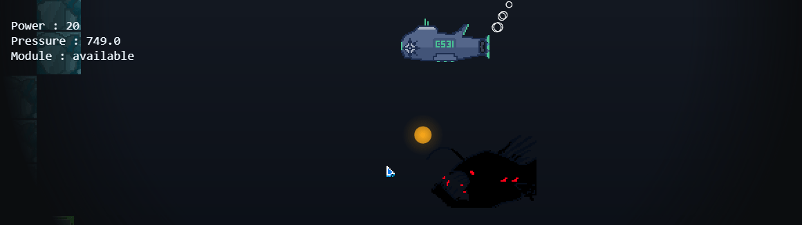
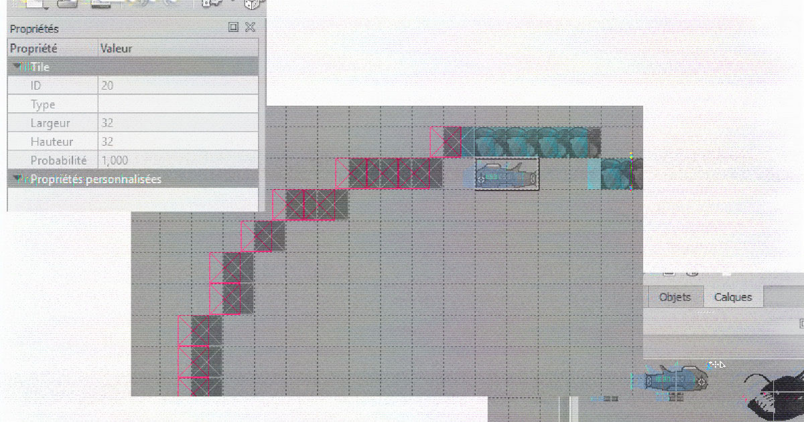

# 13K under the sea


## The game
I Game for js13k

WASD to move 
mouse wheel to modify power

A little sub adventure in the deep of seas

## Map with tiled

### Create new map with Tiled
A map is compsed on 3 distinct layers : 2 tiles layers and 1 object layer
the first tile layer is for collisionable tiles, the second for stickers (not exported) and the object layers contain all entities

Entitities

 - boss boss position
 - stream 
 
    properties :
    _x,y_ stream direction
 
 - start the position of the submarine on map load
 - end
 
    properties:
    _next_ the next level name
    
 - shutdown shutdown the submarine
 - boot restart the sub after a sutdown
 - dialog
    
    properties :
    _ct_ dialog content
 
 - powup
    
    properties
    a : active?
    i : type (only 1 is supported)

## inspired by 

 - The Aquatic Adventure of the Last Human 
 - 
## Info +

Used again my vector 2d lib minified & simplified for js13k [v2d.js](https://github.com/Julien-laville/Lost/blob/gh-pages/src/v2d.js)

A tiny script for tiled map export compression was made : [micromiseLevel.js](https://github.com/Julien-laville/Lost/blob/gh-pages/src/micromiseLelevel.js)

### Tiled export to _13°°° bytes under the seas_
 
 
 
 Par défaut tiled exporte chaque layer sous forme d'une tableau unidimmensionnel l'id du type de cellule.
 
 Sans aucune approche scientifique, il a été decidé de stocker seulement la position des ids utilisés (x,y,z) en convertisant chaque valeur en equivalent ascii (limite a 127 valeurs possible).
 
 ##### Tile fragment export
 ```
"ti":"\u0014\u00147\u0015\u00148\u0016\u00149\u0017\u00147\u0018\u00148\u0019\u00149\u001a\u00147\u001b\u00148\u001c\u00149\u001d\u00147\u001e\u00148\u001f\u00149  

```
 
 Une tuile est donc truelle de 3 caracteres ascii.
 les autres information (propriétés de la map et entitities) sont copiés tel quel
    
  ## Todo
   - <input type="checkbox"> Tileset (.TSX) loader
   - <input type="checkbox"> Collision
   - <input type="checkbox"> Moar hostiles
   - <input type="checkbox"> Empty tiles
   - <input type="checkbox"> in & out
   - <input type="checkbox"> foreground
   - <input type="checkbox"> mine
   - <input type="checkbox"> shockwave
   - <input type="checkbox"> music, sfx